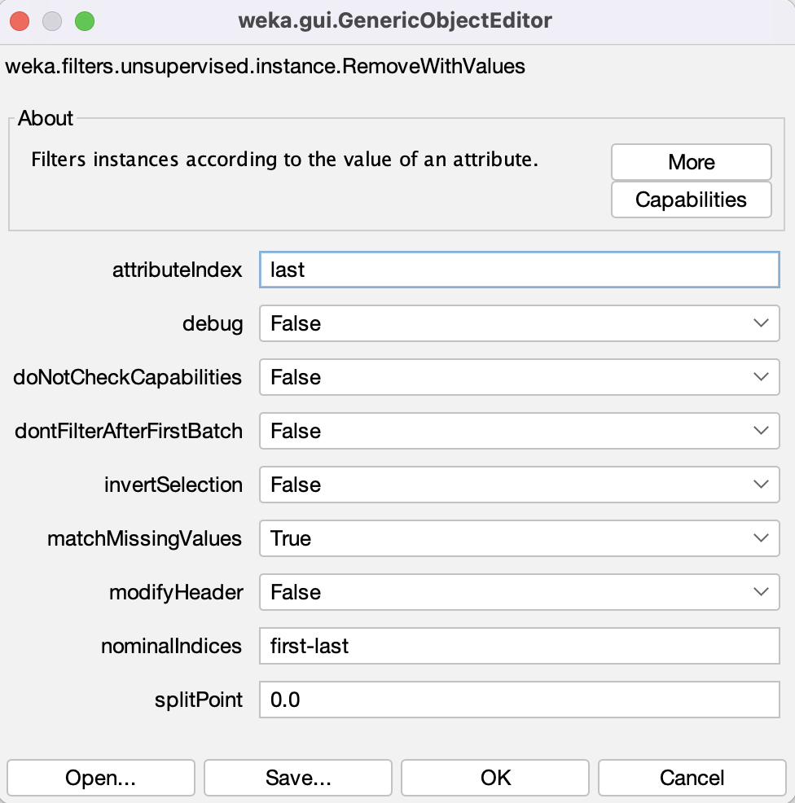
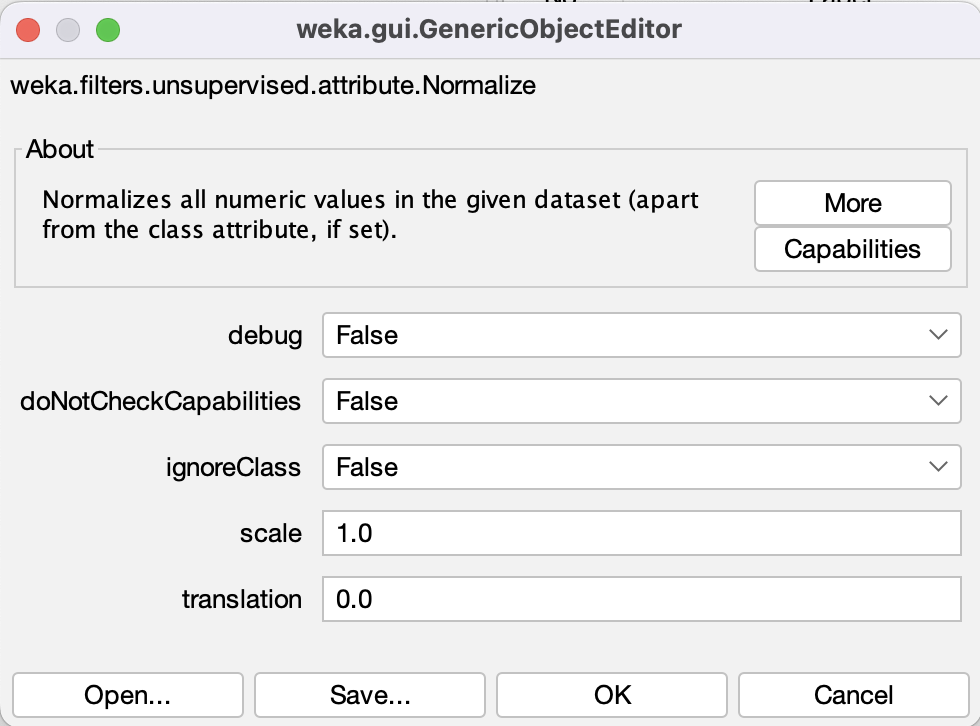
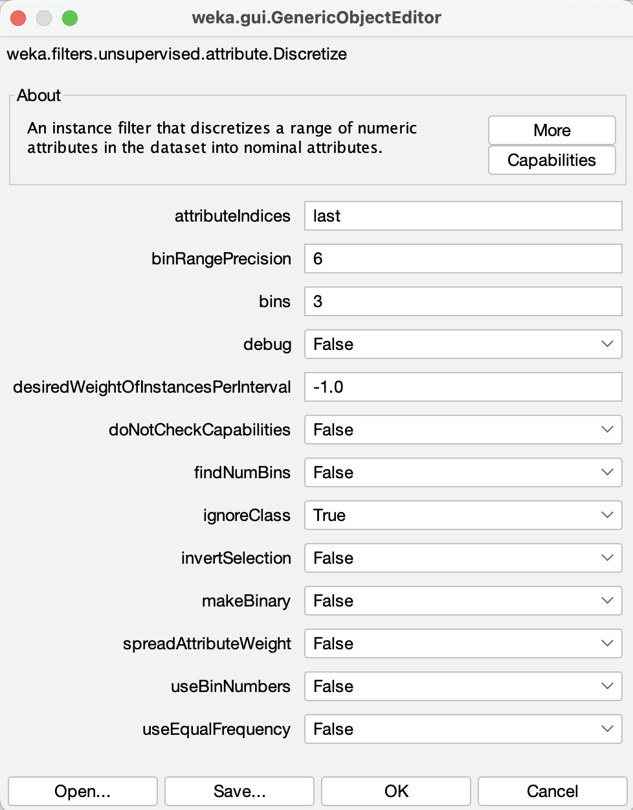
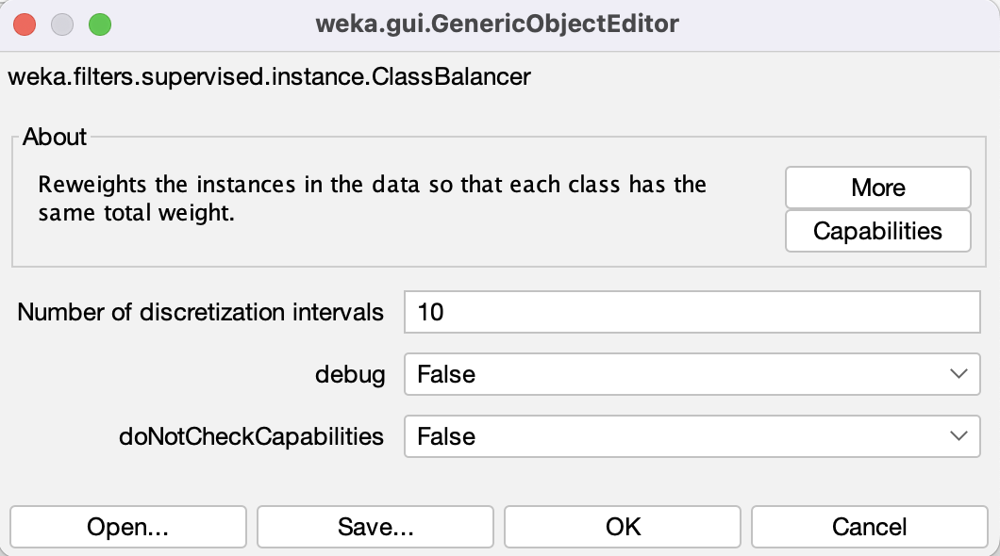
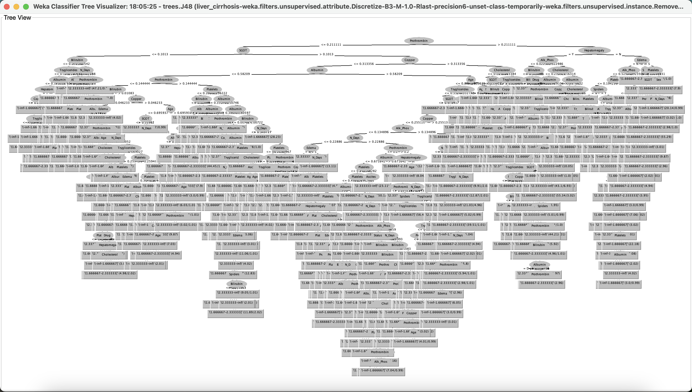
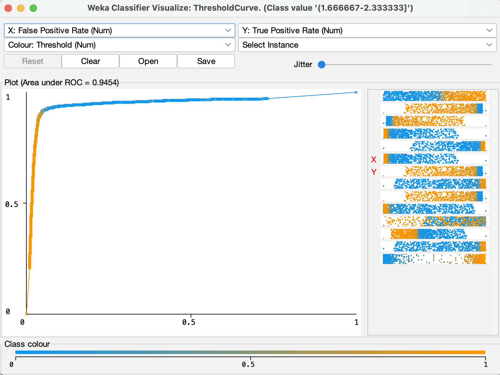

# Inženjerstvo podataka i znanja - projekat 3
Kreiranje modela mašinskog učenja za klasifikaciju korišćenjem Weka alata.
## Dataset
Korišćen je [dataset](https://www.kaggle.com/datasets/aadarshvelu/liver-cirrhosis-stage-classification) koji sadrži različite podatke o pacijentu, među kojima i "stage" koji predstavlja numeričku oznaku stanja ciroze jetre kod pacijenta (1-3). Model treba na osnovu ostalih podataka da klasifikuje pacijenta u jedno od tri stanja ciroze.
## Priprema podataka
- **Čišćenje od pogrešnih vrednosti** *weka.filters.unsupervised.instance.RemoveWithValues* sa matchMissingValues na True i attributeIndex na last kako bi matchovao sve instance kojima fali atribut "stage" i uklonio ih. 
- **Skaliranje i normalizacija podataka** *weka.filters.unsupervised.attribute.Normalize* sa scale na 1.0 i translation 0.0 koji normalizuje numeric vrednosti atributa na opseg 0-1
- **Diskretizacija klase** *weka.filters.unsupervised.attribute.Discretize* sa bins na 3, attributeIndices na last i ignoreClass na False da diskretizuje "stage" i pretvori ga iz numeric u nominal tip atributa kako bi omogućili korišćenje classifiera sa "stage" kao klasom
- **Balansiranje skupa podataka** *weka.filters.supervised.instance.ClassBalancer* koji klasama dodaje težine kako bi se nadomestile razlike u broju instanci za svaku klasu (za izabrani dataset ne pravi nikakvu razliku jer već ima približno jednako instanci u svakoj klasi)
## Klasifikacija
Izabrani model mašinskog učenja će biti classifier model za klasifikaciju u različita stanja ciroze jetre. Prikazana je tačnost za više classifiera:

- *rules.ZeroR* 
	- cross validation 10 folds 33.3152%
	- 80-20 split 32.9512%
- *trees.J48*
	- cross validation 10 folds 92.1625%
	- 80-20 split 91.0254%
- *lazy.lBk (KNN=1)*
	- cross validation 10 folds 91.6021%
	- 80-20 split 90.7610%
- *lazy.lBk (KNN=3)*
	- cross validation 10 folds 89.5398%
	- 80-20 split 88.908%
- *lazy.lBk (KNN=5)*
	- cross validation 10 folds 88.1484%
	- 80-20 split 87.7276%
- *bayes.NaiveBayes*
	- cross validation 10 folds 51.4442%
	- 80-20 split 51.7485%

J48 daje najveću tačnost od svih isprobanih klasifikatora. J48 je java implementacija C4.5 algoritma koji je zapravo ekstenzija ID3 algoritma. J48 u ovoj implementaciji sam rešava vrednosti atributa koje nedostaju tako da nije potrebno obrađivati podatke dodatno da se obrišu ili obrade prazne vrednosti.
## Rezultati
Correctly Classified Instances **23040.6322 (92.1625%)**
Incorrectly Classified Instances **1959.3678 (7.8375%)**
Kappa statistic **0.8824**
Mean absolute error **0.0682**
Root mean squared error **0.2176**
Relative absolute error **15.3527%**
Root relative squared error **46.1692%**
Total Number of Instances **25000**

J48 je pokazao najveći *Kappa statistic* parametar od 0.8824 koji predstavlja meru korelacije. Površina ispod ROC (Receiver Operating Characteristic) krive iznosi 0.9454 (što više to bolje, "idealni" klasifikator bi imao 1.00) što se može videti na slici ispod. 

Unpruned J48 je verzija J48 klasifikatora koji ne skraćuje stablo, za rezultate ima stablo drugačije tačnosti koje je veće. U ovom slučaju, veličina unpruned stabla je bila 2439 naspram 1643, ali je tačnost bila vrlo slična, u jednom slučaju veća u drugom manja (92.0289% naspram 92.1625% za 10 fold i 91.2029% naspram 91.0254% za 80-20 split).

Tačnost (*accuracy*) je **92.1625%**, preciznost (*precision*) je **0.922**, odziv (*recall*) je **0.922** i korelacija (*Kappa statistic*) je **0.8824**. Prikaz svih rezultata je dostupan [ovde](results.txt).